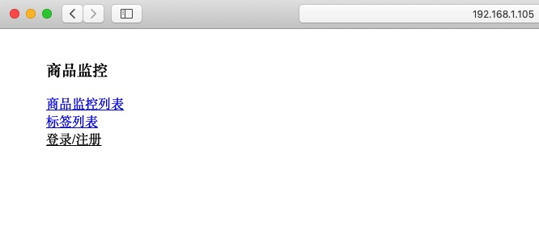

### Shop Watcher Web

---

监控商品的价格，并在降价时发送信息

#### 环境

python3.6

mysql

#### 安装

创建 `Config.py` 文件在项目根目录，内容如下，根据实际情况自行配置。

```python
database_config = {'host':'192.168.1.100',
                   'user':'root',
                   'passwd':'111111',
                   'db_name':'shop_watcher'}
capture_interval = 3600 * 6 # 抓取时间间隔 单位 秒
mail_config = {'smtp':'smtp.sina.com',
               'user':'xxx@sina.com',
               'passwd':'xxxxx'}
```

创建库

```SQL 
CREATE DATABASE IF NOT EXISTS shop_watcher default charset utf8 COLLATE utf8_general_ci;
```

创建表

```python
from database import initDatabase
initDatabase() 
```

#### Flask部署(略)

#### 运行

开启信息抓取（这是个死循环），对比价格，对于低价发送通知

```shell
python3 work.py
```

浏览器访问

